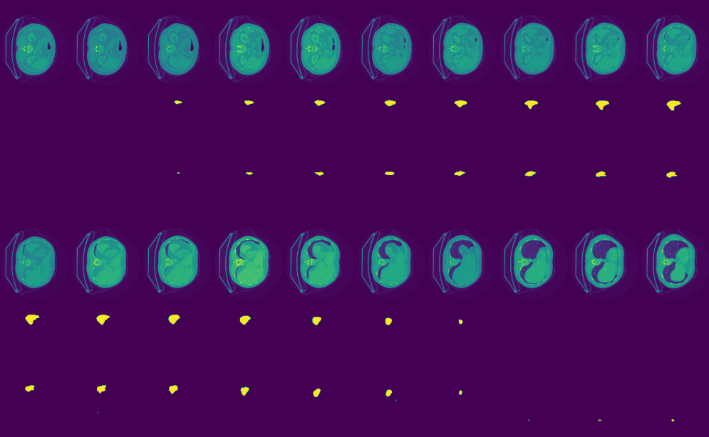

# 3D medical segmentation

# Dataset
- Medical Segmentation Decathlon [Link](http://medicaldecathlon.com/dataaws/)
- spleen 
- Colon 
- Heart

# Model 
- Vnet[Link](https://arxiv.org/abs/1606.04797)
- UNETR[Link](https://arxiv.org/abs/2103.10504)

# Metric (-ing)
| Model   | Dice Score (Spleen) | Loss (Spleen) | Dice Score (Colon) | Loss (Colon) | Dice Score (Heart) | Loss (Heart) |
|---------|---------------------|---------------|--------------------|--------------|--------------------|--------------|
| VNet    | 0.247              | 0.961         | 0.467             | 0.712        | 0.44              | 0.78         |
| UNETR   | 0.007              | 0.992         | 0.371             | 0.865        | 0.409             | 0.79         |

# Visual

